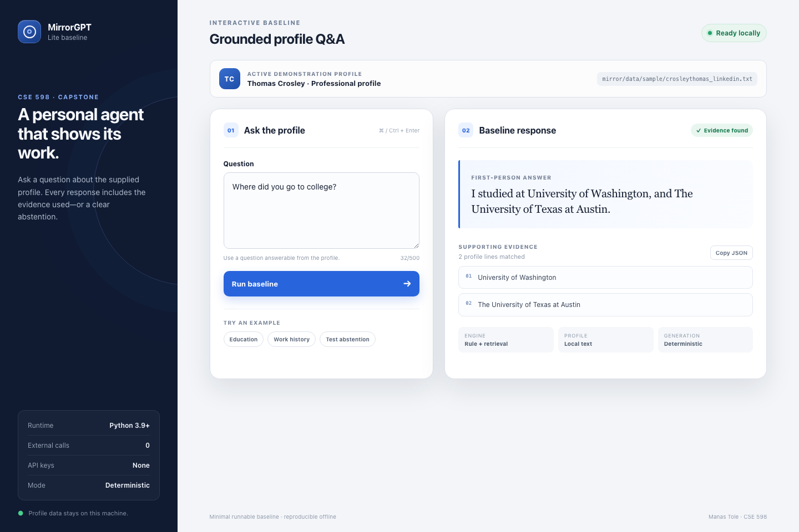

# MirrorGPT Lite

MirrorGPT Lite is a minimal, reproducible personal-profile question-answering
baseline for the CSE 598 capstone proposal. It accepts a plain-text profile and
a natural-language question, produces a first-person answer, and displays the
profile evidence used. When no relevant evidence is available, it explicitly
abstains instead of guessing.



## Reproducibility summary

| Item | Requirement |
| --- | --- |
| Runtime | Python 3.9 or newer |
| Third-party packages | None |
| API keys | None |
| Environment variables | None |
| Network access after download | None |
| Default UI address | `http://127.0.0.1:8765` |
| Expected setup time | Under two minutes when Python is installed |

The submitted baseline is deterministic: the same profile and question produce
the same response.

## Quick start: web interface

From the repository root, start the application:

```bash
python3 app.py
```

The terminal will print:

```text
MirrorGPT Lite UI: http://127.0.0.1:8765
Press Ctrl+C to stop.
```

Open <http://127.0.0.1:8765> in a browser. The page loads the included
demonstration profile. Enter a question and select **Run baseline**. The answer
and supporting evidence appear in the right-hand panel. Press `Ctrl+C` in the
terminal to stop the server.

No installation command is required. `requirements-baseline.txt` is included
to make the absence of third-party dependencies explicit.

## Required concrete test case

### Input

- Profile: `mirror/data/sample/crosleythomas_linkedin.txt`
- Question file: `examples/test1.txt`
- Question: `Where did you go to college?`

### Exact command

```bash
python3 baseline.py \
  --profile mirror/data/sample/crosleythomas_linkedin.txt \
  --input examples/test1.txt \
  --output outputs/test1.json
```

### Expected behavior

The baseline should identify the universities named in the profile, answer in
the first person, and include the matching profile lines as evidence.

### Actual output

```json
{
  "question": "Where did you go to college?",
  "answer": "I studied at University of Washington, and The University of Texas at Austin.",
  "evidence": [
    "University of Washington",
    "The University of Texas at Austin"
  ]
}
```

The command prints this JSON to the terminal and writes the identical content
to `outputs/test1.json`. Evidence from a successful CLI run is captured in
`assets/baseline_test1.png`; the working UI is captured in
`assets/ui_baseline.png`.

## Run an unanswerable test

```bash
python3 baseline.py \
  --profile mirror/data/sample/crosleythomas_linkedin.txt \
  --question "What is your favorite food?"
```

Because the profile does not contain that information, the expected answer is:

```text
I don't know based on the provided profile.
```

## Automated tests

Run all baseline and web API tests from the repository root:

```bash
python3 -m unittest discover -s tests -v
```

Expected result:

```text
Ran 3 tests

OK
```

The tests verify the education answer, the web API response, and validation of
blank questions.

## How the baseline works

1. `baseline.py` reads the UTF-8 profile and question.
2. A small extraction rule handles education questions.
3. Other questions use expanded keyword overlap to rank relevant profile lines.
4. The system returns a first-person answer and the selected evidence.
5. If no evidence matches, the system returns an explicit abstention.
6. `app.py` exposes the same function through a local JSON API and serves the
   files in `web/`.

The web interface does not contain a separate model or hard-coded API response;
form submissions call `POST /api/answer`, which invokes the same
`answer_question` function used by the command-line baseline.

## Inputs, outputs, and configuration

### Command-line interface

```text
python3 baseline.py --profile PROFILE (--question TEXT | --input FILE) [--output FILE]
```

- `--profile`: required UTF-8 text profile.
- `--question`: a question supplied directly on the command line.
- `--input`: a UTF-8 file containing one question; mutually exclusive with
  `--question`.
- `--output`: optional location for the JSON output. Parent directories are
  created automatically.

### Web interface

```text
python3 app.py [--host HOST] [--port PORT]
```

- `--host` defaults to `127.0.0.1`, so the server is available only on the
  current computer.
- `--port` defaults to `8765`.
- The demonstration profile is intentionally fixed at
  `mirror/data/sample/crosleythomas_linkedin.txt` in `app.py`.
- `GET /api/health` reports whether the profile loaded.
- `POST /api/answer` accepts JSON shaped as
  `{"question": "Where did you go to college?"}`.

To use another port:

```bash
python3 app.py --port 8080
```

## Repository layout

```text
.
├── app.py                         # Local web server and JSON API
├── baseline.py                    # Deterministic Q&A baseline
├── web/
│   ├── index.html                 # Accessible application structure
│   ├── styles.css                 # Responsive visual design
│   └── app.js                     # Form, result, copy, and error states
├── examples/test1.txt             # Concrete test question
├── outputs/test1.json             # Checked-in actual output
├── tests/
│   ├── test_app.py                # API and validation tests
│   └── test_baseline.py           # Baseline grounding test
├── assets/
│   ├── ui_baseline.png            # Working UI screenshot
│   └── baseline_test1.png         # Successful CLI/test screenshot
├── deliverables/
│   └── Manas_Tole_CSE598_Capstone_Proposal.docx
└── mirror/                        # Legacy prototype and demonstration data
```

## Known limitations

- Retrieval uses rules and lexical overlap rather than semantic embeddings.
- Education questions have a specialized extraction rule.
- Generic answers may quote a profile line instead of synthesizing fluent text.
- The baseline does not yet support conversation memory, multi-step reasoning,
  file uploads, authentication, or an evaluation harness.
- The included profile is demonstration data. Do not commit private personal
  data without authorization.

## Troubleshooting

- **`python3: command not found`:** install Python 3.9 or newer, then retry.
- **Port 8765 is already in use:** run `python3 app.py --port 8080` and open
  <http://127.0.0.1:8080>.
- **UI loads but a request fails:** confirm that the terminal running `app.py`
  is still open, then check <http://127.0.0.1:8765/api/health>.
- **Run from the repository root:** relative paths in the documented commands
  assume the current directory contains `app.py` and `baseline.py`.

## Planned capstone improvements

The next version will add semantic retrieval, an agentic
retrieve-answer-verify workflow, calibrated abstention, citations,
conversation state, privacy filters, and a balanced evaluation set. It will be
compared with this baseline on correctness, evidence support, abstention
quality, unsupported-claim rate, latency, and cost.

## Legacy prototype

The original 2023 MirrorGPT code remains under `mirror/` for architectural
reference. It depends on an older LangChain/OpenAI/Chroma stack and optional
voice packages. None of those dependencies or API credentials are required for
the reproducible capstone baseline documented above.
